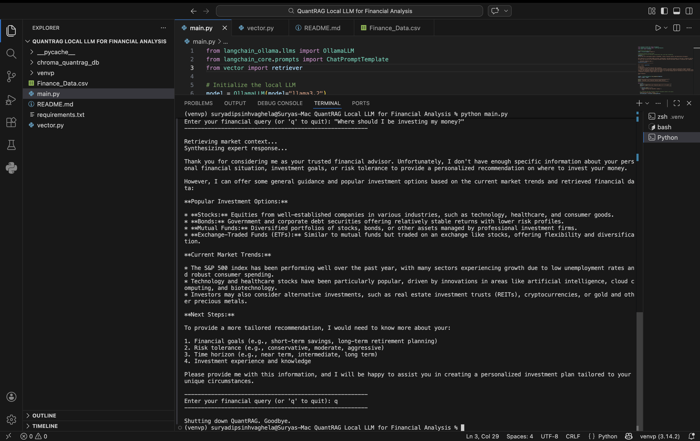

# QuantRAG

**Your Local, Privacy-First Financial Analysis Agent. Smart Quantitative Strategy Starts Here.**

---

## 🌟 Overview

QuantRAG is a local Retrieval-Augmented Generation (RAG) application built for financial question answering and contextual analysis. Instead of sending financial prompts and context to external hosted AI platforms, QuantRAG runs with a local LLM through Ollama and retrieves relevant examples from a local vector database before generating a response.

The system is designed to behave like a disciplined financial analysis assistant:

- it retrieves the most relevant financial records from a curated dataset,
- injects those records into a structured expert prompt,
- and produces professional, context-grounded responses.

A key design principle in this project is **controlled generation**. If the retrieved records are not sufficient, the system is explicitly instructed not to guess or hallucinate.



---

## 🎯 Problem It Solves

Financial question-answering systems often fail in one of two ways:

1. they provide generic answers with no grounding in financial context, or
2. they rely on third-party APIs that may not align with privacy, cost, or local deployment requirements.

QuantRAG addresses both problems by combining:

- **local embeddings**,
- **local vector search**,
- **local LLM inference**, and
- **retrieval-grounded prompting**.

This makes the project especially useful for experimentation, academic research, local prototypes, private financial assistants, and domain-specific AI systems where traceability and privacy matter.

---

## 🚀 Core Features

- **100% local workflow** using Ollama for both generation and embeddings
- **RAG-based financial intelligence** instead of plain prompt-only responses
- **Chroma vector database** for efficient semantic retrieval
- **Structured expert prompting** tuned for professional financial answers
- **Hallucination control** through strict prompt instructions
- **Interactive CLI interface** for asking financial questions in real time
- **Reusable vector store** so the database is only built when needed

---

## 🧠 How QuantRAG Works

QuantRAG follows a simple but effective RAG pipeline:

### Step 1: Load the financial dataset
The system reads a CSV file containing financial instructions, inputs, and expert outputs. Missing values are filled to avoid data processing issues during document construction.

### Step 2: Convert each record into a retrieval document
Each CSV row is transformed into a structured text block with three parts:

- Financial Scenario / Instruction
- Context / Input
- Expert Resolution / Output

This formatting improves semantic retrieval quality and gives the LLM clean, interpretable context.

### Step 3: Generate embeddings locally
The project uses the `mxbai-embed-large` embedding model via Ollama to transform each financial document into vector form.

### Step 4: Store vectors in Chroma
The embedded records are stored inside a persistent Chroma database directory so the system can reuse the index across runs.

### Step 5: Retrieve the most relevant financial records
When the user asks a question, QuantRAG searches the vector store and retrieves the top 4 most relevant financial chunks.

### Step 6: Synthesize the final answer with a local LLM
The retrieved records are injected into a carefully engineered prompt and passed to `llama3.2` through Ollama. The model then generates a professional response grounded in the retrieved financial context.

---

## 🏗️ Architecture

```text
User Query
   │
   ▼
CLI Interface (main.py)
   │
   ▼
Retriever (vector.py)
   │
   ├── Load / Build Chroma Vector DB
   ├── Embed Financial Records with OllamaEmbeddings
   └── Retrieve Top-k Relevant Documents
   │
   ▼
Prompt Template
   │
   ▼
Local LLM via Ollama (llama3.2)
   │
   ▼
Expert Financial Response
```

---

## 📂 Project Structure

```bash
QuantRAG/
├── main.py                 # CLI application and response generation pipeline
├── vector.py               # Data loading, embeddings, vector store, and retriever
├── requirements.txt        # Python dependencies
├── Finance_Data_File.csv   # Financial dataset used for retrieval
├── chroma_quantrag_db/     # Persistent vector database (generated at runtime)
└── README.md               # Project documentation
```

---

## 🔍 Code Walkthrough

### `vector.py`
This file is responsible for the retrieval layer of the system.

It performs the following tasks:

- loads the finance CSV,
- fills null values,
- initializes the Ollama embedding model,
- creates structured `Document` objects,
- builds or loads the persistent Chroma database,
- and exposes a retriever configured to return the top 4 matches.

This file is the knowledge ingestion and semantic search engine of QuantRAG.

### `main.py`
This file acts as the application entry point.

It performs the following tasks:

- initializes the local LLM with Ollama,
- defines the expert financial system prompt,
- receives user queries from the terminal,
- calls the retriever to fetch relevant financial context,
- injects retrieved context into the prompt,
- and prints the final model response.

This file is the reasoning and interaction layer of QuantRAG.

---

## 🧾 Prompt Design Philosophy

A major strength of this project is its prompt discipline.

The system prompt defines QuantRAG as:

- a **Senior Financial Analyst**,
- a **Quantitative Strategist**,
- and a system that must answer using only retrieved financial data.

It also explicitly instructs the model to:

- analyze retrieved records carefully,
- produce structured and professional responses,
- use bullet points for clarity when needed,
- and refuse to fabricate answers when the available context is insufficient.

This greatly improves reliability compared with casual prompt engineering.

---

## 🛠️ Tech Stack

- **Python** – core implementation language
- **LangChain** – prompt chaining and model orchestration
- **LangChain Ollama** – local LLM and embedding integration
- **LangChain Chroma** – vector database integration
- **ChromaDB** – persistent semantic vector storage
- **Pandas** – CSV data processing
- **Ollama** – fully local model runtime

---

## 📦 Requirements

The project currently depends on:

```txt
langchain
langchain-ollama
langchain-chroma
pandas
```

In addition, you need **Ollama installed locally** with the required models available.

Suggested models based on the code:

```bash
ollama pull llama3.2
ollama pull mxbai-embed-large
```

---

## ⚙️ Installation

### 1. Clone the repository
```bash
git clone <your-repository-url>
cd QuantRAG
```

### 2. Create and activate a virtual environment
```bash
python -m venv .venv
```

#### On macOS / Linux
```bash
source .venv/bin/activate
```

#### On Windows
```bash
.venv\Scripts\activate
```

### 3. Install dependencies
```bash
pip install -r requirements.txt
```

### 4. Make sure Ollama is running
```bash
ollama serve
```

### 5. Pull the required models
```bash
ollama pull llama3.2
ollama pull mxbai-embed-large
```

### 6. Place the dataset in the project root
Make sure `Finance_Data_File.csv` is present in the same directory as `main.py` and `vector.py`.

---

## ▶️ Running the Project

Start the CLI app with:

```bash
python main.py
```

On first run, QuantRAG will:

- load the financial dataset,
- create embeddings,
- build the Chroma database,
- and persist it locally.

On later runs, the system reuses the existing database for faster startup.

---

## ✅ Why This Project Is Strong

QuantRAG is not just a basic LLM wrapper.

It demonstrates several strong engineering decisions:

- **domain grounding** through retrieval,
- **privacy-preserving local inference**,
- **persistent vector storage** for practical reuse,
- **structured financial document formatting**,
- **prompt-based hallucination suppression**,
- and **clear separation of ingestion and inference layers**.

These are the kinds of design choices that make a project portfolio-ready and technically meaningful.

---

## 🧪 Use Cases

QuantRAG can be adapted for:

- personal finance Q&A systems
- investment education assistants
- financial knowledge retrieval tools
- internal research copilots for finance teams
- private AI prototypes for advisory workflows
- academic RAG demonstrations in finance or fintech domains

---

## 📜 License

This project is licensed under the MIT License - see the [LICENSE](./LICENSE) file for details.

&copy; Suryadipsinh Vaghela

## Final Note

QuantRAG reflects an important direction in applied AI: **specialized, private, domain-aware intelligence systems**.

Rather than asking a general-purpose model to guess its way through financial reasoning, this project first retrieves relevant evidence, then generates a grounded answer locally. That makes it more trustworthy, more controlled, and more aligned with real-world financial AI use cases.

[def]: image.png